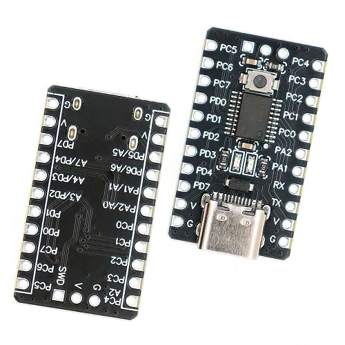

# i2c-to-spi-converter
I2C to SPI/GPIO interface converter based on CH32V003

### CH32V003 board
  
Board: [aliexpress.ru](https://sl.aliexpress.ru/p?key=jQ6k3j5)  
MCU datasheet: [wch-ic.com](https://www.wch-ic.com/downloads/CH32V003DS0_PDF.html)  
MCU reference manual: [wch-ic.com](https://www.wch-ic.com/downloads/CH32V003RM_PDF.html)

### Pinout
```
            SWIO  o  o
        ┌──────┴──┴──┴──────┐
        │   SWIO  V  G      │
   SCK ─┤ PC5           PC4 ├─ MODE
  MOSI ─┤ PC6           PC3 ├─ BUSY
  MISO ─┤ PC7           PC2 ├─ SCL
   NSS ─┤ PD0           PC1 ├─ SDA
  SWIO ─┤ PD1           PC0 ├─ ?
 GPIO1 ─┤ PD2           PA2 ├─ ?
 GPIO2 ─┤ PD3           PA1 ├─ ?
 GPIO3 ─┤ PD4           PD6 ├─ RX
  NRST ─┤ PD7           PD5 ├─ TX
     o ─┤ V               V ├─ o
     o ─┤ G               G ├─ o
        │   CH32V003F4P6    │
        └───────────────────┘
```

|Name|Pin|Group|Description|*|
|-|-|-|-|-|
|SCK|PC5|SPI|SPI master||
|MOSI|PC6|SPI|SPI master||
|MISO|PC7|SPI|SPI master||
|NSS|PD0|SPI|SPI master||
|SWIO|PD1|SWIO|Software update||
|GPIO1|PD2|User GPIO|User GPIO|I/O|
|GPIO2|PD3|User GPIO|User GPIO|I/O|
|GPIO3|PD4|User GPIO|User GPIO|I/O|
|NRST|PD7|NRST|Reset||
|MODE|PC4|Control interface|`HIGH` - data transfer, `LOW` - configuration|IPU|
|BUSY|PC3|Control interface|`HIGH` - busy, `LOW` - ready|O|
|SCL|PC2|I2C|I2C slave||
|SDA|PC1|I2C|I2C slave||
|RX|PD6|UART|Debug UART (not used)||
|TX|PD5|UART|Debug UART||

### Interface
I2C slave address: `0x51`

##### Command byte
```
┌────┬────┬────┬────┬────┬────┬────┬────┐
│ b7 │ b6 │ b5 │ b4 │ b3 │ b2 │ b1 │ b0 │
├────┴────┴────┴────┼────┴────┴────┴────┤
│      action       │      object       │
├───────────────────┼───────────────────┤
│ 0 - GET           │ 0 - SPI           │
│ 1 - RESET         │ 1 - GPIO1         │
│ 2 - SET           │ 2 - GPIO2         │
│ 3 - MODE          │ 3 - GPIO3         │
│ 4 - BAUDRATE      │ 4 - RXC           │
│                   │ 5 - TXC           │
└───────────────────┴───────────────────┘
```
##### Available commands
|Name|Command|Description|Example *(i2c-tools)*|
|-|-|-|-|
|RXC_GET|`0x04`|Get debug RX counter (4 bytes, little-endian)|`i2ctransfer -y 0 w1@0x51 0x04 r4`|
|TXC_GET|`0x05`|Get debug TX counter (4 bytes, little-endian)|`i2ctransfer -y 0 w1@0x51 0x05 r4`|
|RXC_RESET|`0x14`|Reset debug RX counter|`i2ctransfer -y 0 w1@0x51 0x14`|
|TXC_RESET|`0x15`|Reset debug TX counter|`i2ctransfer -y 0 w1@0x51 0x15`|
|GPIO1_GET|`0x01`|Get GPIO1 input value|`i2ctransfer -y 0 w1@0x51 0x01 r1`|
|GPIO2_GET|`0x02`|Get GPIO2 input value|`i2ctransfer -y 0 w1@0x51 0x02 r1`|
|GPIO3_GET|`0x03`|Get GPIO3 input value|`i2ctransfer -y 0 w1@0x51 0x03 r1`|
|GPIO1_SET|`0x21`|Set GPIO1 output value|`i2ctransfer -y 0 w2@0x51 0x21 0x01`|
|GPIO2_SET|`0x22`|Set GPIO2 output value|`i2ctransfer -y 0 w2@0x51 0x22 0x01`|
|GPIO3_SET|`0x23`|Set GPIO3 output value|`i2ctransfer -y 0 w2@0x51 0x23 0x01`|
|GPIO1_MODE|`0x31`|Set GPIO1 [mode](#gpio-modes)|`i2ctransfer -y 0 w2@0x51 0x31 0x02`|
|GPIO2_MODE|`0x32`|Set GPIO2 [mode](#gpio-modes)|`i2ctransfer -y 0 w2@0x51 0x32 0x02`|
|GPIO3_MODE|`0x33`|Set GPIO3 [mode](#gpio-modes)|`i2ctransfer -y 0 w2@0x51 0x33 0x02`|
|SPI_MODE|`0x30`|Set SPI [mode](#spi-modes)|`i2ctransfer -y 0 w2@0x51 0x30 0x01`|
|SPI_BAUDRATE|`0x40`|Set SPI [baudrate](#spi-baudrates)|`i2ctransfer -y 0 w2@0x51 0x40 0x05`|

##### GPIO modes
|Mode|Value|Description|
|-|-|-|
|GPIO_MODE_IN_FL|`0x00`|Input floating|
|GPIO_MODE_IN_PU|`0x01`|Input pull-up|
|GPIO_MODE_OUT_PP|`0x02`|Output push-pull|
|GPIO_MODE_OUT_OD|`0x03`|Output open-drain|

##### SPI modes
|Mode|Value|Description|
|-|-|-|
|SPI_MODE_0|`0x00`|CPOL = 0, CPHA = 0|
|SPI_MODE_1|`0x01`|CPOL = 0, CPHA = 1|
|SPI_MODE_2|`0x02`|CPOL = 1, CPHA = 0|
|SPI_MODE_3|`0x03`|CPOL = 1, CPHA = 1|

##### SPI baudrates
|Mode|Value|Description|
|-|-|-|
|SPI_BAUDRATE_2|`0x01`|48MHz / 2 = 24MHz|
|SPI_BAUDRATE_4|`0x02`|48MHz / 4 = 12MHz|
|SPI_BAUDRATE_8|`0x03`|48MHz / 8 = 6MHz|
|SPI_BAUDRATE_16|`0x04`|48MHz / 16 = 3MHz|
|SPI_BAUDRATE_32|`0x05`|48MHz / 32 = 1,5MHz|
|SPI_BAUDRATE_64|`0x06`|48MHz / 64 = 750kHz|
|SPI_BAUDRATE_128|`0x07`|48MHz / 128 = 375kHz|
|SPI_BAUDRATE_256|`0x08`|48MHz / 256 = 187,5kHz|
